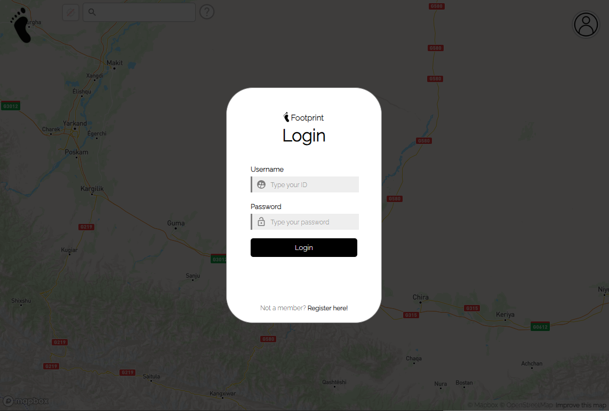
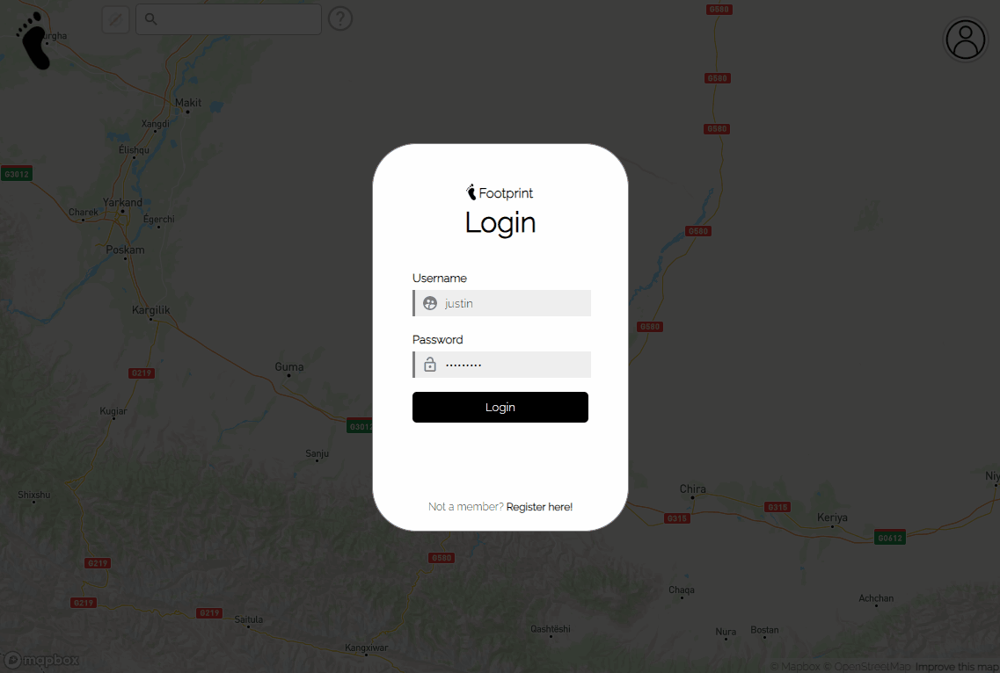
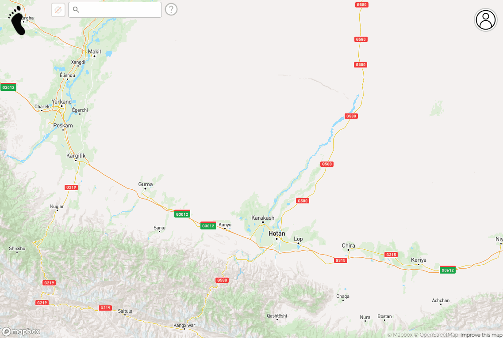
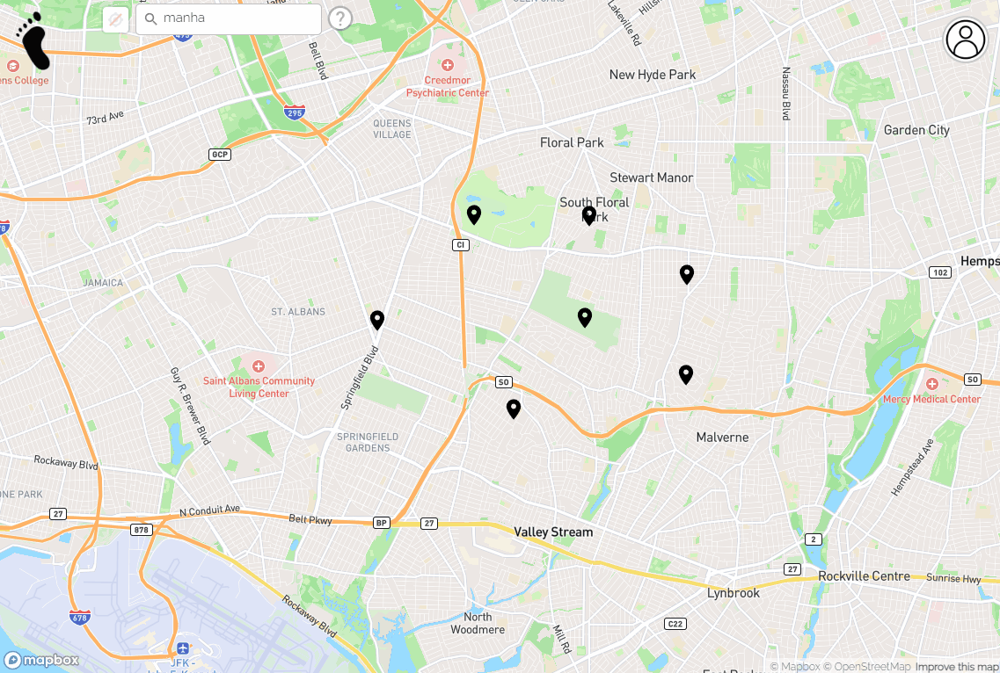
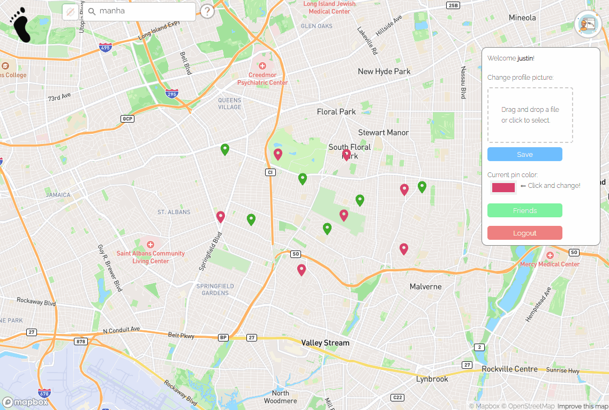

# 👣 Footprint  
    
http://footprint.boutique/  
Runs until 2024.02.01!

## Detail   
An interactive map that allows you to pin the places you have been and share them with friends. This application is based on Mapbox which is a popular platform for creating custom maps and location-based applications provided by Uber. It provides a suite of tools and APIs for developers to integrate mapping and location services into their applications.  

## Tech stack
        

<!-- ## Service Architecture  
AWS EC2  
OS -> Ubuntu  
Front Server -> NginX 80  
Back Server -> Node Server 1035  
MongoDB Atlas   -->
  
## Service Guide  
### Login Page  

### Welcome Page

### Guideline will walk you through!

### Search any places and find out

### Add, view, edit, and delete pin!

### Set profile, change pin color!

### Follow friends and share pins

### You can remove friend from the list
